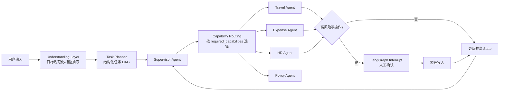

# Enterprise AI Assistant

面向企业内部事务的生产级 Multi-Agent。后端使用 FastAPI + LangGraph，模型通过 OpenAI-compatible Chat Completions API 接入；PostgreSQL 保存工作流 checkpoint 与业务写操作，Redis 缓存制度查询，Milvus 存储制度向量，LangSmith 记录 Agent、规划器和工具调用 trace。前端提供任务进度与 Human-in-the-loop 确认界面。

## 为什么不是 Intent Router

请求不会通过“差旅/报销/请假”关键词直接分流，而是依次经过：



- Understanding Layer 只处理当前用户输入，规范目标、解析相对日期并标记歧义。
- Task Planner 通过模型的 structured output 生成任务 DAG、能力需求、依赖和风险等级。
- Supervisor 只负责任务调度，不代替领域 Agent 执行业务。
- Capability Registry 根据任务声明的能力集合选择提供者，不查看原始对话文本。
- 领域 Agent 不接收聊天历史；它们只读取当前任务、`slots` 和 `tool_results` 的共享状态投影。

## State 设计

核心定义位于 `src/enterprise_ai_assistant/graph/state.py`：

| 字段 | 用途 |
|---|---|
| `messages` | API 对话记录；仅 Understanding Layer 读取 |
| `user_goal` | 规范化后的整体目标 |
| `tasks` | 带依赖、能力、风险和状态的任务 DAG |
| `slots` | 跨 Agent 的结构化业务上下文 |
| `tool_results` | 可审计的工具执行结果 |
| `current_agent` | 当前能力提供者 |
| `active_task_id` | 当前执行任务 |
| `pending_confirmation` | 等待用户确认的写操作及 payload |

Agent 之间不发送消息。例如 Expense Agent 安排“回来提醒报销”时，读取 Travel Agent 写入 `slots.travel_application` 的行程结束日期和申请编号。

## 示例流程

输入：`下周去上海出差，帮我申请，回来提醒报销`

1. 理解层解析目的地及日期；信息不足时不会臆造，会提示补充出差事由或具体日期。
2. Planner 生成 `travel.application.write` 和依赖它的 `expense.reminder.write` 两个任务。
3. Travel Agent 准备申请并触发 interrupt；此时尚未写入业务表。
4. 用户确认后，以 `user_id:task_id` 为幂等键提交申请，并更新 `slots.travel_application`。
5. Expense Agent 从共享 State 读取旅行信息并安排提醒。
6. 每个 Supervisor、Planner、Agent 与写工具调用都带 LangSmith trace。

请假提交和报销提交同样必须确认；制度读取和提醒安排不需要确认。

## 目录

```text
src/enterprise_ai_assistant/
├── agents/          # Supervisor 与领域 Agent
├── api/             # FastAPI 路由和 DTO
├── core/            # 配置、日志、领域类型
├── db/              # PostgreSQL schema/bootstrap
├── graph/           # LangGraph State 与工作流
├── repositories/    # PostgreSQL、Redis、Milvus 边界
└── services/        # LLM、理解/规划、能力注册表
frontend/            # React + TypeScript + Vite
tests/               # 无真实外部依赖的工作流测试
```

## 运行

需要 Docker、Docker Compose、[uv](https://docs.astral.sh/uv/) 和 Node.js 18+。

```bash
cp .env.example .env
# 编辑 .env，至少设置 OPENAI_API_KEY 与 LANGSMITH_API_KEY
docker compose up --build
```

- 前端：<http://localhost:5173>
- API 文档：<http://localhost:8000/docs>
- 健康检查：<http://localhost:8000/api/v1/health>

### 本地开发（推荐）

本地开发时只在 Docker 中运行基础设施

终端 1——启动 PostgreSQL、Redis、etcd、MinIO 和 Milvus：

```bash
docker compose up -d postgres redis etcd minio milvus
```

终端 2——启动 FastAPI 后端：

```bash
uv sync
uv run uvicorn enterprise_ai_assistant.main:app --reload
```

终端 3——启动前端：

```bash
cd frontend
npm install    # 首次运行或依赖变化时执行
npm run dev
```

开发地址：

- 前端：<http://localhost:5173>
- API 文档：<http://localhost:8000/docs>
- 健康检查：<http://localhost:8000/api/v1/health>

Vite 支持前端热更新；Uvicorn 使用 `--reload` 后支持后端代码自动重载。日常启动时，如果依赖没有变化，可以跳过 `uv sync` 和 `npm install`。

所有配置均来自环境变量，完整示例见 `.env.example`。`OPENAI_BASE_URL` 可指向任何实现兼容 `/chat/completions` 与 `/embeddings` 的服务。官方 OpenAI 文档说明 Chat Completions 使用 `model` 与 `messages`，API Key 应从服务端环境变量安全加载；本项目遵循这一边界。

## API

所有会话接口要求 `X-User-ID` 请求头。真实部署应由 API Gateway/OIDC 中间件覆盖此值，不允许客户端自行声明身份。

```bash
curl -X POST http://localhost:8000/api/v1/chat \
  -H 'Content-Type: application/json' \
  -H 'X-User-ID: u-1001' \
  -d '{"message":"查询差旅住宿标准"}'
```

确认高风险操作：

```bash
curl -X POST http://localhost:8000/api/v1/conversations/<conversation-id>/confirm \
  -H 'Content-Type: application/json' \
  -H 'X-User-ID: u-1001' \
  -d '{"approved":true}'
```

## 测试与质量

```bash
uv run pytest
uv run ruff check .
uv run mypy src
cd frontend && npm install && npm run build
```

测试使用可注入的 PlanningService、内存 checkpointer 和内存 repository，不消耗模型额度；覆盖复合任务拆分、人工确认、拒绝、跨 Agent State 传递和幂等写入。

## 生产扩展点

- 将示例 policy bootstrap 替换为带版本、权限标签和生效区间的离线摄取流水线；检索时增加 ABAC filter 与引用返回。
- ActionRepository 当前展示可靠的幂等边界；接入真实 OA/财务/HR 系统时建议使用 outbox、状态回查和补偿任务。
- 在 API Gateway 接入 OIDC/JWT、租户隔离、速率限制、审计日志与 PII 脱敏。
- 对 planner structured output 增加业务规则校验、任务数量上限和 prompt-injection 检测。
- PostgreSQL checkpoint 支持多实例恢复；大规模部署需设置连接池、checkpoint 清理策略和 Redis/Milvus 高可用。
- 将提醒写入专用调度服务（如 Temporal/Celery），本 Demo 只演示了状态与工具边界。

## 已知边界

这是可运行的生产级架构基线，而不是已经对接某家企业 OA 的成品。真实差旅额度、年假余额、发票校验和组织审批链需要对应系统 API 与权限模型；在这些契约确定前，代码不会伪造成功结果。
