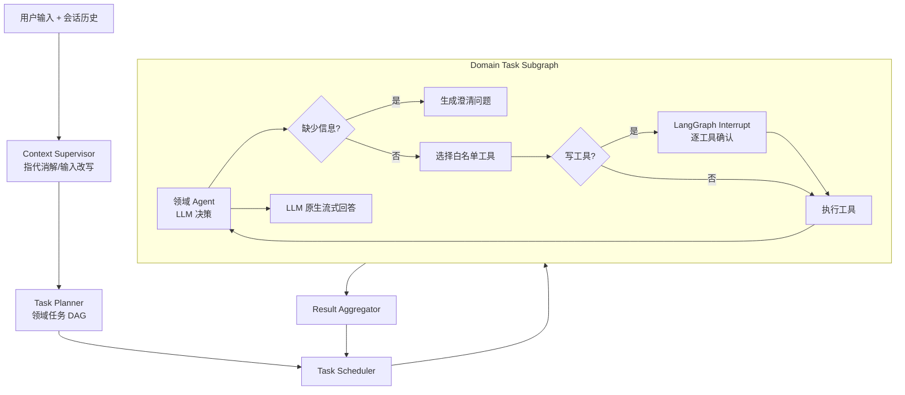

# Enterprise AI Assistant

面向企业内部事务的生产级 Multi-Agent。后端使用 FastAPI + LangGraph，模型通过 OpenAI-compatible Chat Completions API 接入；PostgreSQL 保存工作流 checkpoint 与业务写操作，Redis 缓存制度查询，Milvus 存储制度向量，LangSmith 记录 Agent、规划器和工具调用 trace。前端提供任务进度与 Human-in-the-loop 确认界面。

## 架构

系统把会话理解、任务规划、领域执行和企业工具调用分成独立边界：



- Context Supervisor 阅读完整对话，只负责消解指代、分析整体意图并生成独立请求；不抽取领域字段。
- Planner 只生成任务领域、目标、成功标准和依赖；不选择工具、不生成参数、不判断风险。
- Travel、Expense、HR、Policy Agent 分别拥有独立 Prompt 和最小工具白名单。
- 每项计划任务调用一次通用领域子图；子图根据任务领域装配 Prompt 和最小工具集。
- 领域子图在受限循环中自行判断字段、请求补充信息、选择工具并解释工具结果。
- 父图与领域子图只通过 `DomainTaskRequest` 和 `DomainTaskResult` 通信；模型消息、重试计数和待执行工具保留在子图内部。
- 工具风险由服务端注册表声明。所有写工具在执行前保存 checkpoint 并要求用户确认。
- 用户身份、会话 ID、请求 ID 和幂等键来自可信运行时，不作为模型参数暴露。

## State 设计

核心定义位于 `src/enterprise_ai_assistant/graph/state.py`：

| 字段 | 用途 |
|---|---|
| `messages` | 持久化对话记录，供 Context Supervisor 消解上下文 |
| `user_goal` | 当前轮次已改写的独立请求 |
| `tasks` | 带领域、目标、依赖和状态的任务 DAG |
| `artifacts` | 按 task ID 保存的结构化工具产物 |
| `tool_results` | 可审计的工具执行结果 |
| `current_agent` | 当前能力提供者 |
| `active_task_id` | 当前执行任务 |
| `domain_request` | 父图发给领域子图的任务、依赖产物与可信上下文 |
| `domain_result` | 领域子图返回的状态、回答、产物和工具审计结果 |

`domain_messages`、工具决策和确认状态属于子图私有状态。领域 Agent 不共享内部消息，
后续任务只接收依赖任务在 `artifacts` 中留下的结构化结果。人工确认通过 LangGraph
interrupt payload 暴露，API 不依赖子图内部节点名。

## 企业工具

工具统一通过 `EnterpriseToolProvider` 接口接入，当前实现和后续 OA、财务、HR API 适配器遵循同一契约。替换后端实现不需要修改 Agent 或工作流。

| Agent | 可用工具 |
|---|---|
| Travel | 差旅制度查询、创建差旅申请 |
| Expense | 报销制度查询、创建报销单、设置普通或差旅报销提醒 |
| HR | 人事制度查询、假期余额查询、提交请假申请 |
| Policy | 通用制度查询 |

所有领域都可调用 `request_information` 暂停当前任务并向用户询问缺失字段。工具输入使用 Pydantic 严格校验，未知字段会被拒绝。

## 示例流程

输入：`下周去上海出差，帮我申请，回来提醒报销`

1. Supervisor 结合历史会话把输入改写为独立请求，不抽取差旅字段。
2. Planner 生成 Travel 任务和依赖它的 Expense 任务。
3. Travel Agent 自行识别字段；缺失时调用 `request_information`，完整时提出创建差旅工具调用。
4. 子图冻结精确工具参数并触发 interrupt；确认请求必须携带对应的 `confirmation_id`，通过后再使用“会话 + 请求 + 任务 + 工具”幂等键执行。
5. Travel 的结构化工具结果写入 `artifacts`，再作为依赖结果交给 Expense Agent。
6. Expense Agent 选择提醒工具并独立确认，最终回答由领域 LLM 原生流式输出。

所有写工具都需要确认；制度和余额读取不需要确认。

## 目录

```text
src/enterprise_ai_assistant/
├── agents/          # Supervisor 与领域 Agent
├── api/             # FastAPI 路由和 DTO
├── core/            # 配置、日志、领域类型
├── db/              # PostgreSQL schema/bootstrap
├── graph/           # 父调度图、领域任务子图与各自 State
├── repositories/    # PostgreSQL、Redis、Milvus 边界
└── services/        # LLM、理解/规划、能力注册表
frontend/            # React + TypeScript + Vite
tests/               # 无真实外部依赖的工作流测试
```

## 运行

需要 Docker、Docker Compose、[uv](https://docs.astral.sh/uv/) 和 Node.js 18+。

```bash
cp .env.example .env
# 编辑 .env，至少设置 OPENAI_API_KEY 与 LANGSMITH_API_KEY
docker compose up --build
```

- 前端：<http://localhost:5173>
- API 文档：<http://localhost:8000/docs>
- 健康检查：<http://localhost:8000/api/v1/health>

### 本地开发（推荐）

本地开发时只在 Docker 中运行基础设施

终端 1——启动 PostgreSQL、Redis、etcd、MinIO 和 Milvus：

```bash
docker compose up -d postgres redis etcd minio milvus
```

终端 2——启动 FastAPI 后端：

```bash
uv sync
uv run uvicorn enterprise_ai_assistant.main:app --reload
```

终端 3——启动前端：

```bash
cd frontend
npm install    # 首次运行或依赖变化时执行
npm run dev
```

开发地址：

- 前端：<http://localhost:5173>
- API 文档：<http://localhost:8000/docs>
- 健康检查：<http://localhost:8000/api/v1/health>

Vite 支持前端热更新；Uvicorn 使用 `--reload` 后支持后端代码自动重载。日常启动时，如果依赖没有变化，可以跳过 `uv sync` 和 `npm install`。

所有配置均来自环境变量，完整示例见 `.env.example`。`OPENAI_BASE_URL` 可指向任何实现兼容 `/chat/completions` 与 `/embeddings` 的服务。官方 OpenAI 文档说明 Chat Completions 使用 `model` 与 `messages`，API Key 应从服务端环境变量安全加载；本项目遵循这一边界。

## API

所有会话接口要求 `Authorization: Bearer <token>` 请求头。用户身份取自令牌的 `sub`
声明，客户端无法自行声明身份。生产部署由企业 SSO 颁发令牌；本地联调可在
`APP_ENV=development` 且 `DEV_LOGIN_ENABLED=true` 时换取测试令牌：

```bash
TOKEN=$(curl -s -X POST http://localhost:8000/api/v1/auth/dev-token \
  -H 'Content-Type: application/json' \
  -d '{"user_id":"u-1001"}' | python -c 'import sys,json;print(json.load(sys.stdin)["access_token"])')
```

```bash
curl -X POST http://localhost:8000/api/v1/chat \
  -H 'Content-Type: application/json' \
  -H "Authorization: Bearer $TOKEN" \
  -d '{"message":"查询差旅住宿标准"}'
```

### SSE 流式响应

前端默认调用 `POST /api/v1/chat/stream`，通过 streaming fetch 消费 SSE。服务端会推送以下事件：

| 事件 | 内容 |
|---|---|
| `metadata` | 会话 ID 与本次运行 ID |
| `progress` | Supervisor、Planner、领域循环和工具执行进度 |
| `answer_start` | 一个领域回答开始，包含 message/agent/task ID |
| `token` | 带 `user-visible` 标签的模型原生内容增量 |
| `done` | 完整任务、artifacts、工具结果和确认状态 |
| `error` | 流建立后的执行错误 |
| `gap` | 重连游标已超出事件缓冲窗口，需改用会话快照恢复 |

每条事件都带 `id:` 序号，另有 `: heartbeat` 注释帧在空闲时保活。

命令行验证：

```bash
curl -N -X POST http://localhost:8000/api/v1/chat/stream \
  -H 'Content-Type: application/json' \
  -H "Authorization: Bearer $TOKEN" \
  -d '{"message":"查询差旅住宿标准"}'
```

高风险操作确认后的剩余任务通过
`POST /api/v1/conversations/{conversation_id}/confirm/stream` 继续流式执行。Nginx 已关闭该路径的代理缓冲。

### 断线恢复

图执行跑在后台运行里，SSE 连接只是订阅者：**关闭标签页或网络抖动不会中断执行**，
工作流会继续跑完并落检查点。客户端重连访问：

```bash
curl -N http://localhost:8000/api/v1/conversations/<conversation-id>/stream \
  -H "Authorization: Bearer $TOKEN" -H 'Last-Event-ID: 42'
```

- 带 `Last-Event-ID` 只补发缺失的增量；游标超出缓冲窗口则收到 `gap` 事件，改用
  `GET /api/v1/conversations/{conversation_id}` 重建状态。
- 运行结束后事件仍保留 `RUN_RETENTION_SECONDS`，断线的客户端回来仍能取到 `done`。
- 重连是只读旁观：断开不会影响后台执行。
- 执行期间读会话返回 `status=running` 与 `run_id`，不会把半成品检查点误报为失败。
- 同一会话同时只允许一次执行，并发提交返回 409；重复提交同一个 `request_id`
  视为客户端重试，复用同一次运行而不会重跑。
- 创建流时可传 `on_disconnect: "cancel"` 要求断线即终止执行，默认由
  `RUN_ON_DISCONNECT` 决定（默认 `continue`）。

单进程部署使用内存事件桥。多副本部署需要把 `StreamBridge` 换成跨进程实现
（如 Redis Streams），或按 `conversation_id` 做粘性路由，否则重连可能落到没有该
运行的实例上。

确认高风险操作：

```bash
curl -X POST http://localhost:8000/api/v1/conversations/<conversation-id>/confirm \
  -H 'Content-Type: application/json' \
  -H "Authorization: Bearer $TOKEN" \
  -d '{"confirmation_id":"<pending-confirmation-id>","approved":true}'
```

## 可观测性

`GET /api/v1/metrics` 暴露 Prometheus 指标，与健康检查一样供基础设施抓取，不要求业务令牌：

| 指标 | 用途 |
|---|---|
| `assistant_http_requests_total` / `assistant_http_request_duration_seconds` | 请求量与延迟分布，标签使用路由模板避免会话 ID 造成标签基数爆炸 |
| `assistant_llm_calls_total` / `assistant_llm_call_duration_seconds` | 按 agent 维度的模型调用次数与耗时 |
| `assistant_llm_tokens_total` / `assistant_llm_cost_usd_total` | token 消耗与按配置单价折算的成本 |
| `assistant_tool_invocations_total` / `assistant_tool_duration_seconds` | 企业工具成功率与耗时 |
| `assistant_confirmations_total` | 高风险操作的人工确认通过率 |
| `assistant_budget_rejections_total` | 因会话用量超限被拒绝的请求数 |

每次请求结束会输出一条 `llm_usage` 结构化日志，包含调用次数、输入/输出 token 和折算成本。

设置 `CONVERSATION_TOKEN_BUDGET` 后，单个会话累计 token 达到上限时新请求返回 429。
计数存放在 Redis，Redis 不可用时放行而不是阻断业务。

## 测试与质量

```bash
uv run pytest
uv run ruff check .
uv run mypy
uv run python -m evals.runner   # 回归评测，需要可用的模型服务
cd frontend && npm install && npm run build
```

测试使用可注入的 PlanningService、领域 Runtime、内存 checkpointer 和企业工具实现，不消耗模型额度；覆盖 DAG 校验、子图状态隔离、领域工具白名单、非法工具自恢复、复合任务、逐工具确认、拒绝传播、原生流过滤和请求级幂等。

## 生产扩展点

- 将 policy bootstrap 替换为带版本、权限标签和生效区间的离线摄取流水线；检索时增加 ABAC filter 与引用返回。
- 为 `EnterpriseToolProvider` 增加 OA、财务和 HR 远端适配器，并配套 outbox、状态回查和补偿任务。
- 在 API Gateway 接入 OIDC/JWT、租户隔离、速率限制、审计日志与 PII 脱敏。
- 增加会话级并发租约、模型/工具熔断、分布式限流和请求级成本预算。
- 后台运行注册表落库并加租约与孤儿回收，使进程崩溃后的半途运行可被识别和恢复；
  事件流改用 Redis Streams 承载，支持多副本下的断线重连。
- PostgreSQL checkpoint 支持多实例恢复；大规模部署需设置连接池、checkpoint 清理策略和 Redis/Milvus 高可用。
- 将提醒工具后端接入专用调度服务（如 Temporal/Celery）。

## 已知边界

这是可运行、可替换后端的生产级架构基线。具体企业的差旅额度、发票校验、组织审批链、身份权限和业务 API 仍需通过 `EnterpriseToolProvider` 适配，并在上线前完成安全评审、容量测试和故障演练。
